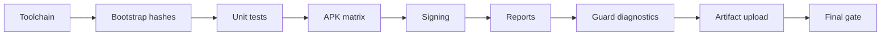

# RAFCODEΦ Beta Operational Orchestration

## Purpose

This document defines the beta pipeline as an operational control surface, not just a CI job.

The pipeline must answer four questions quickly:

1. **Can the app build?**
2. **Were APKs generated for the required ABI contract?**
3. **Were release APKs signed and hashed?**
4. **Did diagnostics run even when a prior stage failed?**

## Operating model

## Required stages

| Stage | Purpose | Failure policy |
|---|---|---|
| Android toolchain | Provision SDK, NDK, CMake and Gradle inputs | Required |
| Bootstrap hashes | Validate SHA256/BLAKE3 bootstrap contract | Required |
| APK matrix | Run tests and build debug/release APK variants | Required |
| Baremetal guard build | Compile low-level smoke diagnostic | Required |
| PSS3 lab build | Compile optional audit tool | Required |
| BLOCKER_BETA gate | Prevent known blocking beta evidence from passing | Required |

## Optional diagnostic stages

| Stage | Purpose | Failure policy |
|---|---|---|
| Baremetal guard selftest | Capture host-side smoke output | Non-blocking |
| PSS3 audit | Run only when trace data exists | Non-blocking |
| Dashboard render | Publish direct Markdown summary | Non-blocking |
| Artifact upload | Upload generated reports and APK matrix | Non-blocking |

## Artifact contract

A healthy beta run should generate:

- `dist/apk-matrix/ARTIFACT_MANIFEST.txt`
- `dist/apk-matrix/APK_SIZE_REPORT.tsv`
- `dist/apk-matrix/APK_SIZE_DIFF_RELEASE.tsv`
- `dist/apk-matrix/SHA256SUMS.txt`
- `dist/apk-matrix/signed/*.apk`
- `dist/apk-matrix/unsigned/*.apk`
- `out/beta-dashboard.md`
- `out/bootstrap_baremetal_guard_smoke.txt`
- `out/pss3_failure_report.txt`

## Dashboard design rules

The GitHub Actions summary must be:

- **Direct**: one screen should show the operational state.
- **Readable**: tables should use human file sizes and clear stage names.
- **Visual**: Mermaid flowchart and compact visual bars are preferred over raw logs.
- **Auditable**: artifact counts, SHA256 count and release track must be visible.
- **Honest**: failed required stages must remain red at the final gate.

## Release posture

The beta workflow may use local validation signing for internal builds.

Official release signing must use explicit release secrets and must not rely on the generated local keystore.

## Operator rule

Do not stop at the first failure.

Run all diagnostics, upload every available artifact, render the dashboard, then let the final gate decide the run status.
